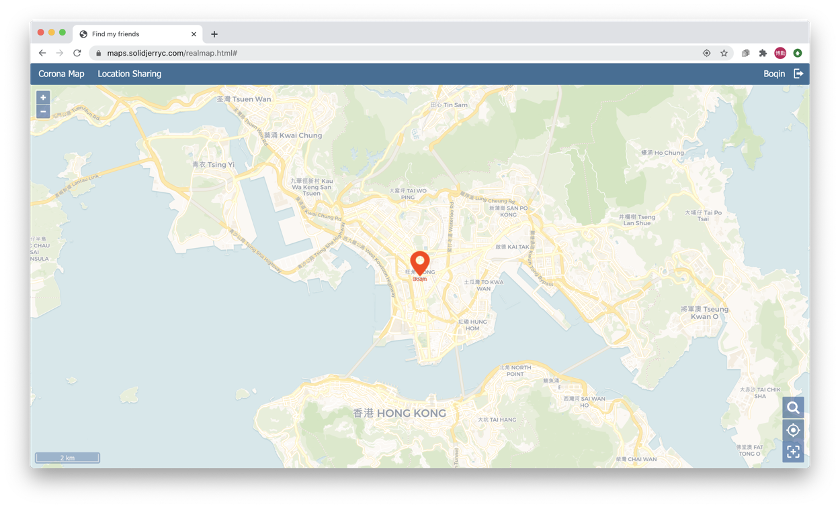
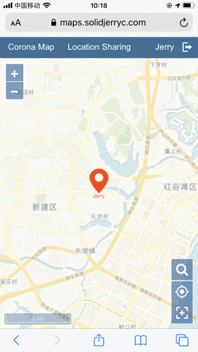
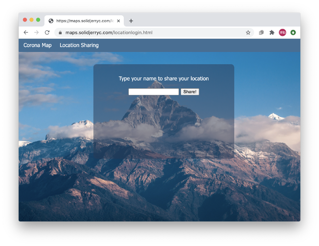
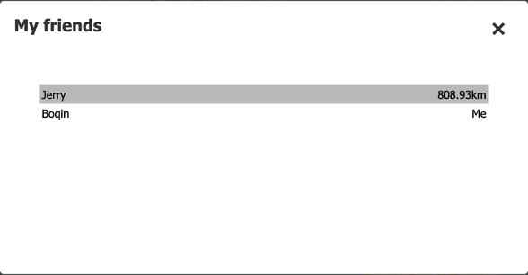

# Location sharing

Location sharing is a map that allows the users to share their geolocations to friends and see each other on the map. The whole system has 3 main parts: Database, Python backend and web-page frontend.

Click [here](https://maps.solidjerryc.com/locationlogin.html) to visit the website.

## 1. Database
The database stores the current users who are sharing the locations. In order to support spatial data, I used PostgreSQL with PostGIS extension. The structure of the table is shown below, with following is the DDL code of the table. The Python code has access to the database.

Table 1 The structure of the table in the database
|Name|Type|Description|
|--|--|--|
|session|integer|The session id|
|name|varchar(40)|The username (Primary key)|
|geom|geometry(point, 4326)|The geometry column of the table|
|lasttime|timestamp|The timestamp of the last active time|

The DDL is:

    create table locations(
        session int,
        name varchar(40) primary key,
        geom geometry(point, 4326),
        lasttime timestamp
    );

## 2. Python backend
Python is a backend connector between the frontend web-page and database. I used Python flask to create an API to receive the AJAX request from Javascript. Once a request is received, the Python code checks if the user is in the database, if so, updates the record and returns all users' positions. If not, insert the record and return all users' positions.

The following link is an example of request. Every 10 seconds the frontend page sends the current location to the backend. The Python backend receives the data and updates the location of this user, and returns the locations of all users.

**Example**: 

    https://maps.solidjerryc.com/upload/api?user=Jerry&lat=22.3193039&lon=114.16936101&sessionid=1

## 3. Webpage
The front page consists of two parts, the login page and the map page. I use the cookies to record the login page. Use can input the name and start to share the geolocation. When logging in successfully, the webpage sends the AJAX requests to the server every 10 seconds. And update the position points on the map.

### 3.1 Layouts
In the latest version, the website is designed to fit both desktop devices and mobile devices. Basically, the website is made up with 3 parts, the navigation bar, the map window and the function buttons. The navigation bar contains tab pages and login information. The map window is the main part of my project. It shows the base map and the locations of every logged in user. The function buttons overlay the base map. They provide functions to control the map window.

 Figure 1 The horizontal layout of desktop devices

 Figure 2 The vertical layout of mobile devices

## 4. Functions

### 4.1 Login information

On the right side of the navigation bar, it shows the currently logged in user’s name with an exit button. If a user clicks on the exit button, the login information will be removed and the page will be redirected to the login page.

 Figure 3 Login page

### 4.2 Zoom in/out buttons

These buttons are located at the top left corner. By clicking them, the extent of the map can be changed. On mobile devices, two-finger pinch gestures can also support zooming.

### 4.3 Search button

The button  is the search button. After clicking it, a small window pops out and it shows every user in the current session. Also, the distances to the current user are written after usernames. Click on the username can lead the map to this user.

 Figure 4 My friends window

### 4.4 Extent buttons

There are two extent buttons at the right bottom corner. The first one is the “Locate me” button. Clicking this button can switch the map to the current user’s position. The second one is the “Find all” button. This button can zoom to the extent of all users.

 Figure 5 Extent buttons

## 5. Further improvement and outlook

Users can create a private chat room for sharing their locations to friends. When loggin, users can input chat room id to join the existing chat room. If it doesn’t exist, user can create a new one to share with their friends.

## 6. Deployment

The website should be published and the user can use it to share the locations. So we created a virtual machine server on Alibaba cloud in Frankfurt. We installed a PostgreSQL 11 as the spatial database. So set the connection information in the Python code. In order to run the Python flask application, we used the Gunicorn. Most browsers don't allow cross origin requests, in order to make the front page to send AJAX requests to the Python flask backend, we use Nginx to host both static webpage and the Python flask API. Besides, the HTML5 geolocation API requires the encrypted HTTPS protocol, so I added an A record to my domain and used Let's Encrypt to deploy an SSL certificate to enable the HTTPS requests.

